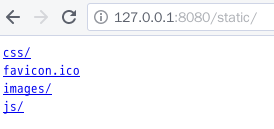
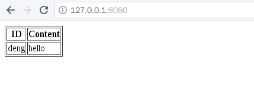

# README

## 简单的web应用程序cloudgo-io

### 　1.  支持静态文件服务

关键代码：

```go
mx.PathPrefix("/static").Handler(http.StripPrefix("/static",http.FileServer(http.Dir(webRoot+"/assets/"))))
```

访问127.0.0.1:8080/static/,可以看到文件服务正常工作



curl 测试的结果

```shell
 curl -v  http://127.0.0.1:8080/static/
*   Trying 127.0.0.1...
* TCP_NODELAY set
* Connected to 127.0.0.1 (127.0.0.1) port 8080 (#0)
> GET /static/ HTTP/1.1
> Host: 127.0.0.1:8080
> User-Agent: curl/7.52.1
> Accept: */*
> 
< HTTP/1.1 200 OK
< Content-Type: text/html; charset=utf-8
< Last-Modified: Tue, 21 Nov 2017 01:55:18 GMT
< Date: Thu, 23 Nov 2017 09:09:50 GMT
< Content-Length: 127
< 
<pre>
<a href="css/">css/</a>
<a href="favicon.ico">favicon.ico</a>
<a href="images/">images/</a>
<a href="js/">js/</a>
</pre>
* Curl_http_done: called premature == 0
* Connection #0 to host 127.0.0.1 left intact

```

### 2. 支持简单js访问

我写了一个返回服务器时间的api,

关键代码如下


```go
// from apiTime.go
func apiTimeHandler(formatter *render.Render) http.HandlerFunc {
	return func(w http.ResponseWriter, req *http.Request) {
		formatter.JSON(w, http.StatusOK, struct {
			ServerTime string `json:"server_time"`
		}{time.Now().String()})
	}
}
```

```go
// 在server.go的initRoutes函数添加
mx.Handle("/time", timeHandler(formatter))
mx.Handle("/api/time", apiTimeHandler(formatter))
```

```js
//assets/js/time.js
$(document).ready(function() {
    $.ajax({
        url: "/api/time"
    }).then(function(data) {
       $('.time').append(data.server_time);
    });
});

```

模板代码

```html
<html>
<head>
  <link rel="stylesheet" href="static/css/main.css"/>
  <script src="http://code.jquery.com/jquery-latest.js"></script>
  <script src="static/js/time.js"></script>
</head>
<body>
  
  Sample Go Web Application!!
    
      <div>
          <p class="time">
            Now the server time is 
          </p>
      </div>
</body>
</html>
```

模板填充代码

```go
// time.go
func timeHandler(formatter *render.Render) http.HandlerFunc {

	return func(w http.ResponseWriter, req *http.Request) {
		formatter.HTML(w, http.StatusOK, "time", nil)
	}
}
```

curl 测试

```shell
curl -v  http://127.0.0.1:8080/api/time
*   Trying 127.0.0.1...
* TCP_NODELAY set
* Connected to 127.0.0.1 (127.0.0.1) port 8080 (#0)
> GET /api/time HTTP/1.1
> Host: 127.0.0.1:8080
> User-Agent: curl/7.52.1
> Accept: */*
> 
< HTTP/1.1 200 OK
< Content-Type: application/json; charset=UTF-8
< Date: Thu, 23 Nov 2017 09:22:03 GMT
< Content-Length: 81
< 
{
  "server_time": "2017-11-23 17:22:03.083796511 +0800 CST m=+1303.017580454"
}
* Curl_http_done: called premature == 0
* Connection #0 to host 127.0.0.1 left intact
```

浏览器访问http://127.0.0.1:8080/time


### 3. 提交表单，输出表格

关键代码

```go
// service/home.go
func homeHandler(formatter *render.Render) http.HandlerFunc {

	return func(w http.ResponseWriter, req *http.Request) {
		fmt.Println("method:", req.Method)
		if req.Method == "GET" {
			formatter.HTML(w, http.StatusOK, "index", nil)
		} else if req.Method == "POST" {
			err := req.ParseForm()
			if err != nil {
				panic(err)
			}
			mf := MyForm{req.Form.Get("id"), req.Form.Get("content")}
			formatter.HTML(w, http.StatusOK, "form", mf)
		}
	}
}
```

Method为get时显示表单，method为post将时用data填充模板




### 4./api/unknown

实现代码

```go
// service/apiunknown
var StatusNotImplemented = 501

func NotImplemented(w http.ResponseWriter, r *http.Request) {
	http.Error(w, "501 Not Implemented", StatusNotImplemented)
}

func NotImplementedHandler() http.Handler { return http.HandlerFunc(NotImplemented) }

```

```go
// 在server.go的initRoutes函数添加
mx.Handle("/api/unknown", NotImplementedHandler())
```

curl 测试

```shell
curl -v http://127.0.0.1:8080/api/unknown
*   Trying 127.0.0.1...
* TCP_NODELAY set
* Connected to 127.0.0.1 (127.0.0.1) port 8080 (#0)
> GET /api/unknown HTTP/1.1
> Host: 127.0.0.1:8080
> User-Agent: curl/7.52.1
> Accept: */*
> 
< HTTP/1.1 501 Not Implemented
< Content-Type: text/plain; charset=utf-8
< X-Content-Type-Options: nosniff
< Date: Thu, 23 Nov 2017 09:49:10 GMT
< Content-Length: 20
< 
501 Not Implemented
* Curl_http_done: called premature == 0
* Connection #0 to host 127.0.0.1 left intact

```

### 5.negroni-gzip源码分析

negroni-gzip是基于negroni开发的对请求内容进行gzip压缩以加快加载速度的中间件。
用法比较简单。只要把它放在其它需要回应请求的中间件前面就好了。比如

```
package main

import (
    "fmt"
    "net/http"

    "github.com/urfave/negroni"
    "github.com/phyber/negroni-gzip/gzip"
)

func main() {
    mux := http.NewServeMux()
    mux.HandleFunc("/", func(w http.ResponseWriter, req *http.Request) {
    	  fmt.Fprintf(w, "Welcome to the home page!")
    })

    n := negroni.Classic()
    n.Use(gzip.Gzip(gzip.DefaultCompression))　//使用默认的压缩级别
    n.UseHandler(mux)
    n.Run(":3000")
}
```
首先从`Gzip`这个函数开始分析
```
func Gzip(level int) *handler {
	h := &handler{}
	h.pool.New = func() interface{} {
		gz, err := gzip.NewWriterLevel(ioutil.Discard, level)
		if err != nil {
			panic(err)
		}
		return gz
	}
	return h
}
```
第一行定义了一个handler结构体的指针
并设置成员变量`pool`.

`handler`结构如下
```
type handler struct {
	pool sync.Pool
}
```


`sync.Pool`的结构
```
type Pool struct {

        // New optionally specifies a function to generate
        // a value when Get would otherwise return nil.
        // It may not be changed concurrently with calls to Get.
        New func() interface{}
        // contains filtered or unexported fields
}
```
我摘取了官方文档对`sync.Pool`的部分说明
>A Pool is a set of temporary objects that may be individually saved and retrieved.
>Any item stored in the Pool may be removed automatically at any time without notification. If the Pool holds the only reference when this happens, the item might be deallocated.
>A Pool is safe for use by multiple goroutines simultaneously.
>Pool's purpose is to cache allocated but unused items for later reuse, relieving pressure on the garbage collector. 

`Pool`会维持一个共享的对象池，，`Pool.Get()`会从中任意移除一个实体并返回，如果对象池空了，在`pool.New != nil`的情况下，会调用`New()`返回一个新的对象，否则返回`nil`
利用`pool`减少内存分配，可以减轻GC的压力，并且是goroutine安全的。
所以这段代码目的是为handler维持一个共享的`pool`,获得并发性能上的提升
对象池里面是一个`*gzip.Writer`对象

Gzip`返回一个`handler`指针,也就是一个negroni-gzip中间件
`handler`实现了`ServeHTTP(w http.ResponseWriter, r *http.Request, next http.HandlerFunc){...}`方法

`ServeHttp`的处理流程
```
1. 处理客户端不能使用gzip编码的情况
2. pool.Get()返回一个共享的*gzip.Writer对象gz
3. gz.Reset(w)将输出定向到http.ResponseWriter
4. 将http.ResponseWriter转换成negroni.NewResponseWriter(w)
5. gzipResponseWriter将gzip.Writer和negroni.ResponseWriter封装在一起
6. 将配置好的gzipResponseWriter交给下一个中间件
7. 处理完要将gz放回pool
```
可以看出，每次请求都会从`pool`中获取`*gzip.Writer`,用完后放回pool,通过Pool的方式实现了多个goroutine之间安全共享同一个`*gzip.Writer`变量
`gzipResponseWriter`实现了`http.ResponseWriter`接口

`writeHeader(code int)`设置响应头的编码方式和状态码
```
// Check whether underlying response is already pre-encoded and disable
// gzipWriter before the body gets written, otherwise encoding headers
func (grw *gzipResponseWriter) WriteHeader(code int) {
	headers := grw.ResponseWriter.Header()
	if headers.Get(headerContentEncoding) == "" {
		headers.Set(headerContentEncoding, encodingGzip)
		headers.Add(headerVary, headerAcceptEncoding)
	} else {
        //如果响应已经编码了，就将grw.w重定向到null,将grw.w设为nil
		grw.w.Reset(ioutil.Discard) 
		grw.w = nil
	}
	grw.ResponseWriter.WriteHeader(code)
	grw.wroteHeader = true
}

```
```
// Write writes bytes to the gzip.Writer. It will also set the Content-Type
// header using the net/http library content type detection if the Content-Type
// header was not set yet.
func (grw *gzipResponseWriter) Write(b []byte) (int, error) {
	if !grw.wroteHeader {
		grw.WriteHeader(http.StatusOK)
	}
    // 如果已经编码了，grw.w会为nil，则直接调用ResponseWriter.Write并返回
	if grw.w == nil {
		return grw.ResponseWriter.Write(b)
	}
	if len(grw.Header().Get(headerContentType)) == 0 {
		grw.Header().Set(headerContentType, http.DetectContentType(b))
	}
	return grw.w.Write(b)
}
```


这个中间件把`compress/gzip`封装为一个可以对http响应文件编码的gzipResponseWriter，通过临时对象池共享`*gzip.Writer`，提高并发性能。是一个高效的中间件。
